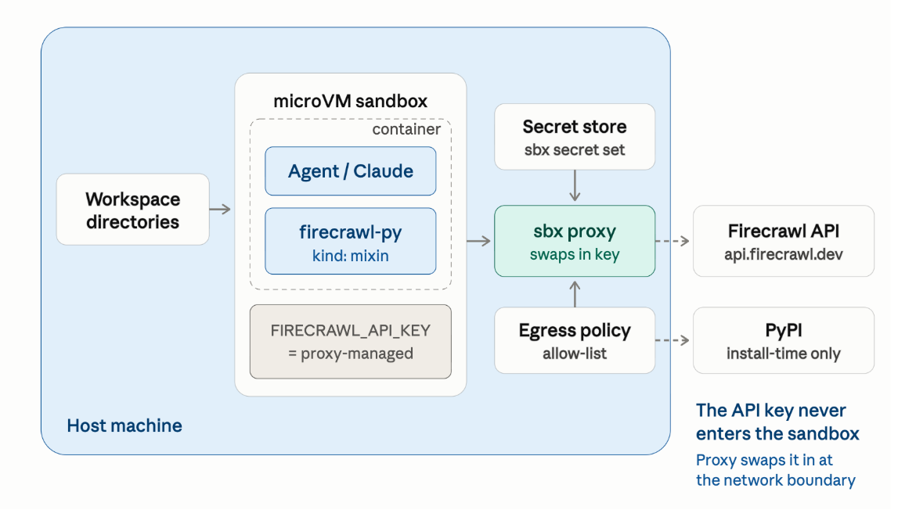

# Firecrawl kit for Docker Sandboxes



A [Docker Sandboxes](https://docs.docker.com/ai/sandboxes/) kit (`kind: mixin`) that adds live web access to
any sandbox agent via the [Firecrawl](https://www.firecrawl.dev/) Python SDK (`firecrawl-py`).

Layer it onto whatever agent you run and it can search the web, scrape a page to clean markdown, and crawl a
site, instead of answering from training-cutoff knowledge.

## What the kit does

Four observable things, so each is independently verifiable (see [Verify the kit](#3-verify-the-kit)):

1. Installs `firecrawl-py==4.44.0` as the agent user (`1000`), and fails the sandbox create if the install or
   the post-install import check fails.
2. Declares a `firecrawl` credential. The key is swapped into the `Authorization` header by the sbx proxy on
   requests to `api.firecrawl.dev`, and is never baked into the image or written to the sandbox.
3. Allows egress to `api.firecrawl.dev` (plus PyPI, at install time) via `permissions.network.allow`. Kit
   network rules add to your sandbox policy; they do not narrow it. Under Docker's default `balanced` policy,
   general websites (including most documentation sites) return a proxy 403, so Firecrawl is the agent's
   route to them. Under `deny-all`, `api.firecrawl.dev` is the only web host the agent can reach.
4. Ships an `agentInstructions` note so the agent knows the capability exists, how to call it, and which
   sandbox constraints apply to it.

## 0. Prerequisites

- The `sbx` CLI, v0.45 or later. Docker Desktop is not required. On macOS, per
  [Docker's install docs](https://docs.docker.com/ai/sandboxes/): `brew install docker/tap/sbx`.
- Sign in once with `sbx login`.
- A global network policy, set once with `sbx policy init balanced` (or `deny-all`). Until this runs, every
  `sbx run` fails with `global network policy has not been initialized`.

> Kits are experimental and in Early Access. This kit is on kit spec v2. sbx v0.45 introduced kit spec v3 and
> keeps supporting v2 for built-in agents, but v3 workloads and mixins cannot be combined with v2 kits. A v3
> port of this kit is planned.

## 1. Store the Firecrawl API key

Get a key from [firecrawl.dev](https://www.firecrawl.dev/app/api-keys) (it looks like `fc-...`). Store it once
with sbx's secret manager. The key never enters the kit; the proxy injects it at runtime, which is why
`sbx run` has no `-e` flag:

```console
echo "$FIRECRAWL_API_KEY" | sbx secret set -g firecrawl   # -g = available to all sandboxes
```

Running `sbx secret set -g firecrawl` with no piped value prompts for the key interactively instead. Confirm
it stored:

```console
sbx secret ls
```

On the **first** `sbx run` with this kit, sbx asks you to approve sending the `firecrawl` credential to
`api.firecrawl.dev` and records a binding in `~/.config/sbx/credentials.yaml`. Because the value already lives
in the secret store, accept the defaults; no env-var or file source is needed. The kit declares only *what* it
needs and *where to inject it*, so you stay in control of *where the key comes from*.

The credential is marked `required`. In an interactive `sbx run`, that means sbx prompts for the binding. In a
non-interactive create (`--detached`, CI) there is no prompt: sbx creates the sandbox with the credential
withheld and prints `WARN: credential not sent: no binding authorizes this service`, and scrapes then fail
with a 401 because the literal `proxy-managed` placeholder reaches Firecrawl. For unattended use, write the
binding to `~/.config/sbx/credentials.yaml` first:

```yaml
bindings:
  firecrawl:
    apiKey:
      domains: [api.firecrawl.dev]
```

If `sbx policy ls` shows `Governance: Managed by <org>`, one more step is needed before scrapes work; see
[Centrally governed hosts](#centrally-governed-hosts).

## 2. Launch the sandbox with the kit

From a local clone (the kit lives at the repo root):

```console
git clone https://github.com/firecrawl/firecrawl-docker-sandbox.git
sbx run --kit ./firecrawl-docker-sandbox/ claude
```

Straight from git, pinned to a commit. Kit references must pin a 40-hex commit SHA; branches and tags are
rejected, and `:latest` on an OCI reference is rejected too:

```console
git ls-remote https://github.com/firecrawl/firecrawl-docker-sandbox.git main   # resolve the SHA
sbx run --kit "git+https://github.com/firecrawl/firecrawl-docker-sandbox.git#ref=<commit-sha>" claude
```

From the published image. Every merge to `main` publishes
`docker.io/firecrawl/firecrawl-docker-sandbox:latest` via [`scripts/push-kit.sh`](scripts/push-kit.sh);
`sbx` rejects `:latest`, so resolve the tag to a digest first. Use the plain `inspect` output: the `--format`
path parses the kit's YAML config blob as JSON and fails:

```console
digest=$(docker buildx imagetools inspect docker.io/firecrawl/firecrawl-docker-sandbox:latest | awk '/^Digest:/ {print $2}')
sbx run --kit "oci://docker.io/firecrawl/firecrawl-docker-sandbox@$digest" claude
```

### Choosing the agent

The trailing argument (`claude` above) is the coding agent that runs inside the sandbox, a separate axis from
the kit. Any supported agent works, and `sbx run --help` lists them:

```
claude, codex, copilot, cursor, devin, docker-agent, droid, gemini, kiro, opencode, shell
```

So `claude` can be swapped for `codex`:

```console
sbx run --kit ./firecrawl-docker-sandbox/ codex
```

Arguments meant for the agent itself go after a `--` separator, e.g. `sbx run --kit ./firecrawl-docker-sandbox/ codex -- --help`.

The kit only assumes the base image ships `python3` and `python3-pip`, which every `docker/sandbox-templates`
image does. On a custom base image without them, the install hook stops with a message saying so.

## 3. Verify the kit

Inside the sandbox session, `!` shell escapes prove the mixin is really there. Each check covers an
independent layer, from a cheap import up to a full end-to-end scrape.

**i. The package is installed, at the pinned version, in the user-site path:**

```console
!python3 -c "import firecrawl, importlib.metadata as m; print('firecrawl-py', m.version('firecrawl-py'), '->', firecrawl.__file__)"
```

Expect `firecrawl-py 4.44.0` (the pin from this kit's `spec.yaml`) under
`/home/agent/.local/lib/.../site-packages/`, the user-site location that matches the kit installing as user
`1000` rather than as root.

**ii. The credential is a proxy-managed sentinel,** so the real key never enters the sandbox.
`credentials[].apiKey.proxyManaged` makes the engine set `FIRECRAWL_API_KEY` to the literal `proxy-managed`
in-container (the SDK refuses to send a request without *some* value), and the proxy swaps in the real key on
outbound requests to `api.firecrawl.dev`:

```console
!env | grep FIRECRAWL_API_KEY
```

Expect `FIRECRAWL_API_KEY=proxy-managed`. A real `fc-…` value here means the credential is coming from
somewhere other than this kit's proxy injection. An unset variable means your sbx predates per-credential
`proxyManaged`; update the `sbx` CLI.

**iii. End-to-end proof**, scraping a page through the cloud API. This transitively exercises the package, the
credential, and egress to `api.firecrawl.dev`, so run this one if you run only one:

```console
!python3 - <<'PY'
from firecrawl import Firecrawl
fc = Firecrawl()                                   # reads FIRECRAWL_API_KEY
doc = fc.scrape("https://docs.docker.com/ai/sandboxes/", formats=["markdown"])
md = getattr(doc, "markdown", None) or (doc.get("markdown") if isinstance(doc, dict) else "")
print(md[:300])
PY
```

Expect the first few hundred characters of the page's clean markdown.

## Using Firecrawl from the agent

The `agentInstructions` note tells the agent the capability exists. The calls it points at:

```python
from firecrawl import Firecrawl
fc = Firecrawl()

fc.scrape("https://example.com", formats=["markdown"])   # one page -> clean markdown
fc.search("docker sandboxes mixin kit", limit=5)         # search the web, get page content
fc.crawl("https://docs.example.com", limit=20)           # crawl a site/section
fc.search("flight prices", sources=["alexandria"])        # Alexandria (beta): discover providers/tools
fc.scrape_alexandria({"provider": "...", "capability": "...", "options": {}})  # Alexandria: execute
```

Alexandria calls need an API key that has been enabled for the beta; on other keys they return an
authorization error rather than data.

See the [Firecrawl Python SDK docs](https://docs.firecrawl.dev/sdks/python) for the full API (formats,
structured JSON extraction with a schema, crawl options).

Two sandbox-imposed limits are worth knowing, because they look like Firecrawl bugs and are not:

- The kit adds one host; it does not open the web. Under `balanced`, general websites return a proxy 403 to
  `curl` or `requests`, so a URL found in a scrape result has to be scraped through Firecrawl too. Under
  `deny-all`, `api.firecrawl.dev` is the only web host.
- Screenshot and other media formats return links on Firecrawl's storage host, which is outside the allow
  list, so the file cannot be downloaded from inside the sandbox. Widen `permissions.network.allow` in a fork
  if you need them.

## Troubleshooting

**`mount policy denied: /Users/<you>: no applicable policies for op(...)`** at create time: `sbx run` mounts
the current working directory into the sandbox, and mounting your whole home directory is blocked for safety.
Run from any directory other than your home directory.

**`PaymentRequiredError: ... Insufficient credits` (HTTP 402)** on a scrape is the good failure: the request
authenticated (a bad or missing key returns 401, not 402), the account is just out of credits. Top up at
<https://firecrawl.dev/pricing> or lower the request `limit`.

### Centrally governed hosts

A scrape that fails with a proxy-side 403 rather than a Firecrawl error:

```
WebsiteNotSupportedError: ... Blocked by network policy: domain api.firecrawl.dev:443 —
no matching allow rule — blocked by default deny policy
```

means the sandbox is under centralized governance and the managed policy is default-deny with no rule for
`api.firecrawl.dev`. A managed policy **overrides** the kit's own `permissions.network.allow`, and local
`sbx policy allow` rules are ignored for org-managed domains, so neither this kit nor you can widen egress:
only the org can. Confirm with:

```console
sbx policy ls <sandbox-name>        # look for "Managed by <org>" and whether api.firecrawl.dev is allowed
```

If you see `network policy for "api.firecrawl.dev" is managed by your organization; local allow rules are not
applied`, ask whoever owns the governance profile to add an `api.firecrawl.dev` allow rule, mirroring the
shape of any existing per-service rule. PyPI is usually already allowed for installs, so `api.firecrawl.dev`
is the one host to add. Everything else in the kit (SDK install, proxy-injected credential) works either way;
only the outbound scrape is gated. On an ungoverned host with a local `balanced` or `open` policy, no extra
step is needed.

## Developing

Validate the kit the way CI does, with no sbx or Docker daemon required. It runs the authoritative loader from
[docker/sbx-kits-contrib](https://github.com/docker/sbx-kits-contrib) plus the engine-level and repo
consistency checks that loader leaves to the runtime:

```console
cd tools/kitcheck && go run . ../..
```

If you have the `sbx` CLI (v0.45 or later), also run the real thing and a smoke test:

```console
sbx kit validate .
sbx run --kit . shell
```

See [CONTRIBUTING.md](CONTRIBUTING.md) for how to bump the SDK pin and cut a release.
